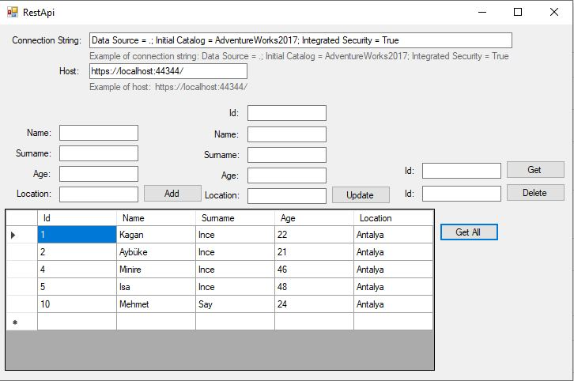

# rest-api-consume

Creating local rest api and consume service using C# windows form and .Net app

C# windows formu ve .Net uygulamasını kullanarak yerel rest api ve consume hizmeti oluşturma

To make this project run at your computer you just need to have database which need to have id, name, surname, age, location columns in the table. Firstly run web form and copy the link. Then run winform and paste your localhost link and you database connection link. Then you will able to do CRUD operation over Rest api.

Bu projenin bilgisayarınızda çalışmasını sağlamak için sadece tabloda kimlik, ad, soyad, yaş, konum sütunlarının bulunması gereken bir veritabanına sahip olmanız gerekir. Öncelikle web formunu çalıştırın ve bağlantıyı kopyalayın. Ardından winform'u çalıştırın ve localhost linkinizi ve veritabanı bağlantı linkinizi yapıştırın. Ardından Rest api üzerinden CRUD işlemi yapabileceksiniz.

  

